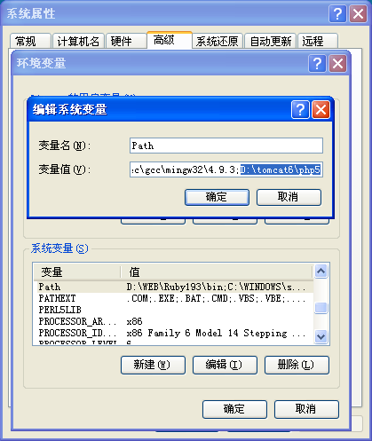
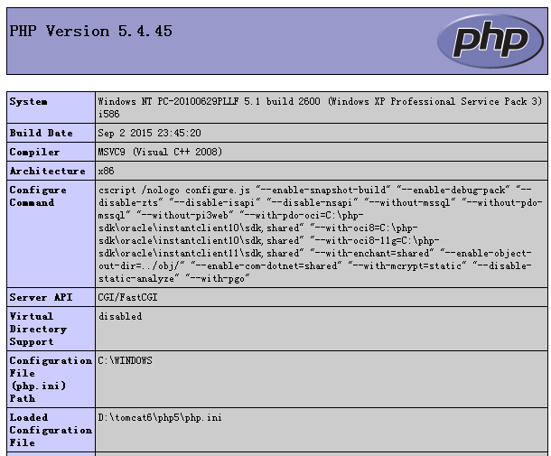

title: GITHUB 

author:
  name: LI YANG
  url: http://mooc1.chaoxing.com/course/87155873.html
output: T15-web-php-mysql.html

--
#  在Tomcat集成PHP
## How to config tomcat to run php

-- 
### 配置Tomcat
1 . 安装php程序;  
2 . 将Php.exe所在的路径加入到系统path中;  
<p></p>
3 . 将php.ini-development 复制一份,改名php.ini;  
4 . 打开php.ini, 去掉 extension_dir = "ext" 这个选项前面的分号;修改 cgi.force_redirect 为 cgi.force_redirect = 0 ;  打开 `extension=php_mysql.dll` 和 `extension=php_mysqli.dll`
```
; On windows:
extension_dir = "ext" 
cgi.force_redirect = 0
extension=php_mysql.dll
extension=php_mysqli.dll
```

5 . 修改tomcat/conf/context.xml文件, 将<Context>加上 privileged="true" 属性, 即<Context privileged="true">
```
<?xml version='1.0' encoding='utf-8'?>
<Context privileged="true">
  <!-- Default set of monitored resources -->
  <WatchedResource>WEB-INF/web.xml</WatchedResource>
</Context>
```
6 . 修改`tomcat/conf/web.xml`文件
> a. 修改`executable`参数为`php-cgi.exe`所在的路径，比如`D:\tomcat6\php5\php-cgi.exe`;   
> b. 修改`cgiPathPrefix`参数为`WEB-INF/phpbin`,即php程序的放置位置；  
> c. 添加`servlet-mapping`,将所有`php`后缀的文件请求提交配置路径`/phpbin/*`  
```
<?xml version="1.0" encoding="ISO-8859-1"?>
<web-app xmlns="http://java.sun.com/xml/ns/javaee"
    xmlns:xsi="http://www.w3.org/2001/XMLSchema-instance"
    xsi:schemaLocation="http://java.sun.com/xml/ns/javaee http://java.sun.com/xml/ns/javaee/web-app_2_5.xsd"
    version="2.5">

  <servlet>
    <servlet-name>php</servlet-name>
    <servlet-class>org.apache.catalina.servlets.CGIServlet</servlet-class>
    <init-param>
      <param-name>clientInputTimeout</param-name>
      <param-value>200</param-value>
    </init-param>

    <init-param>
      <param-name>debug</param-name>
      <param-value>0</param-value>
    </init-param>

    <init-param>
      <param-name>executable</param-name>
      <param-value>D:\tomcat6\php5\php-cgi.exe</param-value>
    </init-param>

    <init-param>
      <param-name>passShellEnvironment</param-name>
      <param-value>true</param-value>
    </init-param>

    <init-param>
      <param-name>cgiPathPrefix</param-name>
      <param-value>WEB-INF/phpbin</param-value>
    </init-param>
    <load-on-startup>5</load-on-startup>
  </servlet>

  <servlet-mapping>
    <servlet-name>php</servlet-name>
    <url-pattern>/phpbin/*</url-pattern>
  </servlet-mapping>

  .....
</web-app>
```
7 . 在webapps\ROOT\WEB-INF 下新建一个phpbin的文件夹, 在文件夹中新建一个index.php，内容为：
```
<?php phpinfo();?>  
```
8 . 在浏览器中访问`http:\\localhost:8080\phpbin\index.php`看到以下内容，说明部署成功：
<p></p>

-- 
### 连接Mysql数据库
1 . 在phpbin的文件夹新建文件db.php
2 . 文件内容如下：
```
<?php
  //-------[基本设定]-----------
  $mysql_server_name ="localhost";
  $mysql_username    ="root";
  $mysql_password     ="123456";
  $mysql_database     ="mysql";
  //----------------------------------

  //建立数据库链接
  $conn=mysql_connect($mysql_server_name,$mysql_username,$mysql_password);
  $sql = "select * from  `user`";
  mysql_select_db($mysql_database,$conn);

  //进行查询
  $result=mysql_query($sql);

  $users=array(); 
  $i=0; 
  while($row=mysql_fetch_array($result,MYSQL_ASSOC)){ 
     $users[$i]=$row; 
     $i++; 
  } 
  echo json_encode(array('dataList'=>$users)); 

  //结束并且释放连接
  mysql_close($conn);
?> 
```
3 . 在浏览器中访问`http:\\localhost:8080\phpbin\db.php`看到以下内容，说明部署成功：
```
{"dataList":[{"Host":"","User":"root","Password":"*6BB4837EB74329105EE4568DDA7DC67ED2CA2AD9","Select_priv":"Y","Insert_priv":"Y","Update_priv":"Y","Delete_priv":"Y","Create_priv":"Y","Drop_priv":"Y","Reload_priv":"Y","Shutdown_priv":"Y","Process_priv":"Y","File_priv":"Y","Grant_priv":"Y","References_priv":"Y","Index_priv":"Y","Alter_priv":"Y","Show_db_priv":"Y","Super_priv":"Y","Create_tmp_table_priv":"Y","Lock_tables_priv":"Y","Execute_priv":"Y","Repl_slave_priv":"Y","Repl_client_priv":"Y","ssl_type":"","ssl_cipher":"","x509_issuer":"","x509_subject":"","max_questions":"0","max_updates":"0","max_connections":"0"}]}
```