title: CSS秘密

author:
  name: LI YANG
  url: http://mooc1.chaoxing.com/course/87155873.html
output: T23-web-css-layout.html

--
#  CSS秘密
## CSS Secret

--
### 0. 自适应按钮
- 将长度值都改成 `em` 单位，按钮效果的值就变成可缩放（依赖于父元素字号）。
- 把半透明的黑色或白色叠加在主色调上 （ `border`  `background` `box-shadow`  `text-shadow` ），即可产生主色调的亮色和暗色变体。
<p>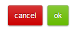</p>

```css
button {
    padding: .3em .8em; 
    border: 1px solid rgba(0,0,0,.1); 
    background: #58a linear-gradient(hsla(0,0%,100%,.2), transparent); 
    border-radius: .2em; 
    box-shadow: 0 .05em .25em rgba(0,0,0,.5); 
    color: white; 
    text-shadow: 0 -.05em .05em rgba(0,0,0,.5); 
    font-size: 125%; 
    line-height: 1.5;
}

button.cancel { 
    background-color: #c00; 
} 
 
button.ok { 
    background-color: #6b0; 
}
```

> 推荐使用HSLA而不是RGBA来产生半透明的白色，因为它的字符长度更短，敲起来也更快。


--
### 1. background-clip属性
- `background-clip:border-box`：背景会延伸到边框所在的区域下层，背景会被元素的 border  box
（边框的外沿框）裁切掉
- `background-clip:padding-box`：浏览器会用内边距的外沿来把背景裁切掉，用这种方法可以实现半透明边框

<p>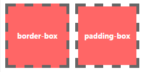</p>

```css
border: 10px solid hsla(0,0%,100%,.5); 
background: white; 
background-clip: padding-box;
```

--
### 2. 多重边框
<p>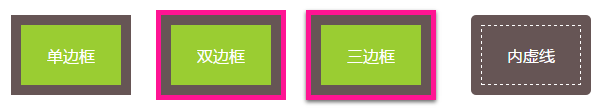</p>
##### **box-shadow 方案** （实线边框）
`box-shadow` 设置正值的扩张半径加上两个为零的偏移量以及为零的模糊值，得到的投影其实就像一道实线边框；它支持逗号分隔语法，可以创建任意数量的投影。
```css
<!-- 单边框 -->
background: yellowgreen; 
box-shadow: 0 0 0 10px #655;

<!-- 双边框 -->
background: yellowgreen; 
box-shadow: 0 0 0 10px #655, 0 0 0 15px deeppink;

<!-- 三边框 -->
background: yellowgreen; 
box-shadow: 0 0 0 10px #655, 
            0 0 0 15px deeppink, 
            0 2px 5px 15px rgba(0,0,0,.6);
```
 
> - 投影跟边框不同，其不影响布局，也不会受到 `box-sizing` 属性的影响。可以通过内边距或外边距来模拟出边框所需要占据的空间。
> - 上述方法所创建出的假边框在外圈，不响应鼠标事件，比如悬停或点击。如果需要鼠标事件，可以给 `box-shadow` 属性加上 `inset` 属性，使投影在内圈。
请注意，此时需要增加额外的内边距来腾出足够的空隙。

##### **outline 方案** （虚线边框）
可以通过 `outline-offset` 属性来控制它跟元素边缘之间的间距，这个属性甚至可以接受负值。只适用于双层边框的场景，因为 `outline` 并不能
接受用逗号分隔的多个值。如果我们需要获得更多层的边框，前一种方案就是我们唯一的选择了。边框不一定会贴合 `border-radius` 属性产生的圆角，因此如果元素
是圆角的，它的描边可能还是直角的。
```css
<!-- 双边框 -->
background: yellowgreen; 
border: 10px solid #655; 
outline: 5px solid deeppink;

<!-- 内虚线 -->
width: 100px;
height: 60px;
background: #655;
border: 10px solid #655;
outline: 1px dashed #fff;
outline-offset: -11px;
border-radius: 5px;
```


--
### 3. 灵活的背景定位
##### **background-position 的扩展语法方案**
在偏移量前面指定关键字即可

```css
background: url(code-pirate.svg) no-repeat #58a; 
background-position: right 20px bottom 10px;
```

#####　**background-origin 方案**
默认情况下，`background-position` 是以 `padding box` 为准的，因此 `top`  `left` 默认指的是 `padding  box` 的左上
角。设置 `background-origin` 属性为 `content-box`， `background-position` 就会以内容区的边缘作为基准。
```css
padding: 10px; 
background: url("code-pirate.svg") no-repeat #58a 
            bottom right; /* 或 100% 100% */ 
background-origin: content-box;
```

#####　**calc 方案**

```css
background: url("code-pirate.svg") no-repeat; 
background-position: calc(100% - 20px) calc(100% - 10px);
```

> 请不要忘记在 calc() 函数内部的- 和+ 运算符的两侧各加一个空白符，否则会产生解析错误！

--
### 4. 边框内圆角
<p>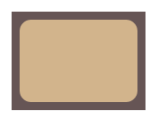</p>
```css
background: tan; 
border-radius: .8em; 
padding: 1em; 
box-shadow: 0 0 0 .6em #655; 
outline: .6em solid #655;
```

--
### 5. 条纹背景
##### **水平条纹**
通过设置渐变的起止点来创建条纹背景，其原理就是起始点等于终止点。
<p>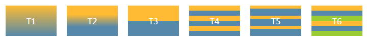</p>
```css
<!-- T1 未设置渐变起止点 -->
background: linear-gradient(#fb3, #58a);

<!-- T2 设置渐变开始于30%终止与70%-->
background: linear-gradient(#fb3 30%, #58a 70%);

<!-- T3 起始点等于终止点-->
background: linear-gradient(#fb3 50%, #58a 50%);

<!-- T4 平铺-->
background: linear-gradient(#fb3 50%, #58a 50%); 
background-size: 100% 20px;

<!-- T5 不等宽平铺-->
background: linear-gradient(#fb3 30%, #58a 30%); 
background-size: 100% 20px;

<!-- T5 三色条纹-->
background: linear-gradient(#fb3 33.3%, 
            #58a 0, #58a 66.6%, yellowgreen 0); 
background-size: 100% 30px;
```


> 如果我们把第二个色标的位置值设置为 0，那它的位置就总是会被前一个位置值代替，即` background: linear-gradient(#fb3 30%, #58a 0);`  等价于 `background: linear-gradient(#fb3 30%, #58a 30%); `

**垂直条纹 & 斜线条纹**

- 垂直条纹：修改参数 `to right` 并且颠倒 `background-size` 参数
- 斜向条纹：增加色标到4个，并且改变宽度
- 斜线条纹平铺：使用 `repeating-radial-gradient()` 函数


<p>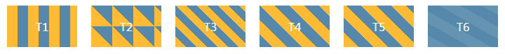</p>
```css
<!-- T1 三色条纹 -->
    background: linear-gradient(to right, #fb3 50%, #58a 0);
    background-size: 30px 100%;

<!-- T2 旋转45度 -->
    background: linear-gradient(45deg, #fb3 50%, #58a 0);
    background-size: 30px 30px;

<!-- T2 增加色标到4个  -->
    background: linear-gradient( 45deg, #fb3 25%, #58a 0, #58a 50%,#fb3 0, #fb3 75%, #58a 0);
    background-size: 30px 30px;

<!-- T2 增加色标到4个，并且增加宽度  -->
    background: linear-gradient( 45deg, #fb3 25%, #58a 0, #58a 50%, #fb3 0, #fb3 75%, #58a 0);
    background-size: 42.426406871px 42.426406871px;

<!-- T2 使用repeating-linear-gradient参数  -->
    background: repeating-linear-gradient( 45deg, #fb3, #fb3 15px, #58a 0, #58a 30px);

<!-- T2 使用半透明白色的条纹叠加在背景色之上来得到浅色条纹  -->
    background: #58a;
    background-image: repeating-linear-gradient(30deg, hsla(0, 0%, 100%, .1), hsla(0, 0%, 100%, .1) 15px, transparent 0, transparent 30px);
```

--
### 6. 复杂的背景图案
见 [lea.verou.me/css3patterns](lea.verou.me/css3patterns) 展示

--
### 7. 伪随机背景
略


--
### 8. 连续的图像边框
- 老式信封样式的边框：把 `background` 设置为 `padding-box` ， 通过 `background-size` 属性来改变条纹的宽度，通过 `border` 属性来改变整个边框的厚度
- 蚂蚁行军边框：把条纹转变为黑白两色，并把边框的宽度减少至 1px，然后再把 `background-size` 改为合适的值，最后把 `background-position` 以动画的方式改变为 `100%`

<p>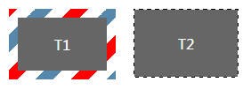</p>
```css
<!-- T1 老式信封样式的边框 -->
padding: 1em; 
border: 1em solid transparent; 
background: linear-gradient(white, white) padding-box, 
            repeating-linear-gradient(-45deg, 
              red 0, red 12.5%, 
              transparent 0, transparent 25%, 
              #58a 0, #58a 37.5%, 
              transparent 0, transparent 50%) 
             0 / 5em 5em;

<!-- T2 蚂蚁行军边框 -->
@keyframes ants { to { background-position: 100% } } 

.marching-ants {
    padding: .5em; 
    border: 1px solid transparent; 
    background: 
        linear-gradient(#666, #666) padding-box, 
        repeating-linear-gradient(-45deg, 
          black 0, black 25%, white 0, white 50% 
        ) 0 / .6em .6em; 
    animation: ants 12s linear infinite; 
}
```

--
### 9. 自适应的椭圆
<p>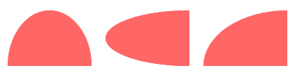</p>
```css
<!-- 半椭圆 -->
    border-radius: 50% / 100% 100% 0 0;
    border: 10px solid #ff6666;
    background: #ff6666;

<!-- 半椭圆 -->
    border-radius: 100% 0 0 100% / 50%;
    border: 10px solid #ff6666;
    background: #ff6666;
}

<!--1/4椭圆 -->
    border-radius: 100% 0 0 0;
    border: 10px solid #ff6666;
    background: #ff6666;
```

--
###  10. 平行四边形 
- 把所有样式（背景、边框等）应用到伪元素上，然后再对伪元素进行变形
- 给宿主元素应用 `position:  relative ` 样式，并为伪元素设置 `position: absolute`，然后再把所有偏移量设置为零，以便让它在水平和垂直方向上都被拉伸至宿主元素的尺寸

<p>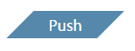</p>

--
### 11. 菱形图片 

<p>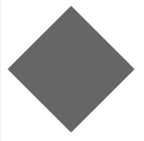</p>
```html
<!-- html代码 -->
<div class="pic">
    
</div>

<!-- css代码  -->
.pic { 
    width: 100px; 
    height: 100px;
    transform: rotate(45deg); 
    overflow: hidden; 
} 
.pic > img { 
    max-width: 100%; 
    transform: rotate(-45deg) scale(1.42); 
    width: 100px;
    height: 100px;
    background: #666;
}
```
--
### 12. 切角效果 
使用渐变加上45度角来模拟
<p></p>
```css
<!-- 单切角  -->
    background: linear-gradient(-45deg, transparent 10px, #58a 0);

<!-- 双切角  -->
    background: linear-gradient(-45deg, transparent 10px, #58a 0)  right, 
    linear-gradient(45deg, transparent 10px, #58a 0)  left;
    background-size: 50% 100%;
    background-repeat: no-repeat;

<!-- 4切角  -->
    background: linear-gradient(135deg, transparent 10px, #58a 0)  top left, 
    linear-gradient(-135deg, transparent 10px, #58a 0) top right, 
    linear-gradient(-45deg, transparent 10px, #58a 0) bottom right, 
    linear-gradient(45deg, transparent 10px, #58a 0) bottom left;
    background-size: 50% 50%;
    background-repeat: no-repeat;
```
--
### 13. 梯形标签页 

<p>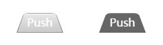</p>
```css
.nav1 > a { 
    position: relative; 
    display: inline-block; 
    padding: 1em 1em 0.3em; 
} 
.nav1 > a::before {
    content: '';
    position: absolute;
    top: 0;
    right: 0;
    bottom: 0;
    left: 0;
    z-index: -1;
    background: #666;
    border-radius: .5em .5em 0 0;
    transform: perspective(.5em) rotateX(5deg);
    transform-origin: bottom;
}

.nav2 > a { 
    position: relative; 
    display: inline-block; 
    padding: 1em 1em 0.3em; 
} 
.nav2 > a::before { 
    content: ''; 
    position: absolute; 
    top: 0; right: 0; bottom: 0; left: 0; 
    z-index: -1; 
    background: #ccc; 
    background-image: linear-gradient( hsla(0,0%,100%,.6), hsla(0,0%,100%,0)); 
    border: 1px solid rgba(0,0,0,.4); 
    border-radius: .5em .5em 0 0; 
    box-shadow: 0 .15em white inset; 
    transform: perspective(.5em) rotateX(5deg); 
    transform-origin: bottom; 
}
```
--
### 14. 简单的饼图 
略

--
### 15. 单侧投影 

box-shadow: `x-offset` `y-offset` `blur`  `expand-radius` `color`
<p>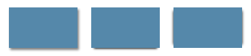</p>
```css
<!-- 普通 三参数 -->
.shadow-org {
    box-shadow: 2px 3px 4px rgba(0,0,0,.5)
}

<!-- 单侧 四参数 -->
.shadow-sig {
    box-shadow: 0 5px 4px -4px black;
}

<!-- 双侧投影 -->
.shadow-both {
    box-shadow: 5px 0 5px -5px black, -5px 0 5px -5px black;
}
```
--
### 16. 不规则投影 
略

--
### 17. 染色效果 
略

--
### 18. 毛玻璃效果

-- 
### 19. 折角效果 

--
### 20. 连字符断行 
`hyphens: auto;`

--
### 21. 插入换行 

--
### 22. 文本行的斑马条纹 

--
### 23. 调整 tab 的宽度 

--
### 24. 连字 


--
### 25. 华丽的 & 符号 

--
### 26. 自定义下划线 
略

--
### 27. 现实中的文字效果 
略

--
### 28. 环形文字 

--
### 29. 选用合适的鼠标光标 
略

--
### 30. 扩大可点击区域 
略

--
### 31. 自定义复选框 

--
### 32. 通过阴影来弱化背景 

--
### 33. 通过模糊来弱化背景 

--
### 34. 滚动提示 

--
### 36. 自适应内部元素 

--
### 37. 精确控制表格列宽 

--
### 38. 根据兄弟元素的数量来设置

--
### 39. 满幅的背景，定宽的内容 

--
### 40. 垂直居中 
- 通过 `translate()` 变形函数实现平移
- 通过视口单位 `vh` `vw` 实现相对于视口的相对位置

<p>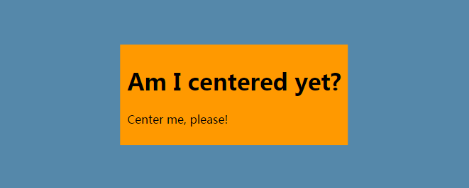</p>

```css
<!-- html代码  -->
    <main> 
        <h1>Am I centered yet?</h1> 
        <p>Center me, please!</p> 
    </main>

<!-- translate()方法 -->
main { 
    position: absolute; 
    top: 50%; 
    left: 50%; 
    transform: translate(-50%, -50%); 
    background: #ff9900;
    padding: 10px;
}

<!-- vh&vw方法 -->
main { 
    width: 18em; 
    padding: 1em 1.5em; 
    margin: 50vh auto 0; 
    transform: translateY(-50%); 
}
```


--
### 41. 紧贴底部的页脚  

--
### 42. 缓动效果 

--
### 43. 逐帧动画 

--
### 44. 闪烁效果 

--
### 45. 打字动画 

--
### 46. 状态平滑的动画 

--
### 47. 沿环形路径平移的动画 